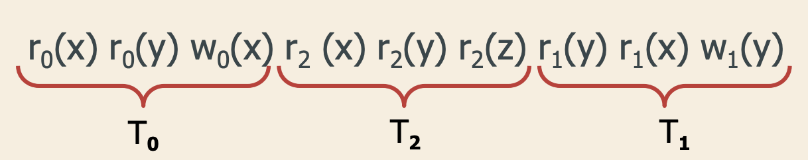

# Data Science
### 1.1 data quality
* noise(modification of  original values) and ouliers(ouliers meaning independ point data)--> remove it before data analysis
* mising value
* duplicate data

### 1.2 handling missing value
* eliminate data objects
* eliminate missing values
* ignore it during data analysis
* replace with all possible value

### 1.3 

## Concurrency Control

### serial schedule
the actions of each transaction appear in same squence.

### equivalence class
- reads-from
wi(x) before rj(x), and there is no other wk(x) between them

- final write

#### View equivalence
- same reads-from 
- same final write

#### conflict serializability
- same conflict set
- each conflict pair has same order

##### conflict graph

if acyclic(no cycle) then S is CSR(conflict serializability)

### Lock
- read lock
- write lock
  
#### Read-Lock
> Shared among different transaction
> followed by unlock

#### Write-Lock
> exclusive(not compatible不兼容的) 

#### Lock Manage
- conflict table

#### 2PL
> a transaction release any lock can't acquire a new lock

#### VSR, CSR, 2PL

### dead lock

#### dead lock detection

## Reliability Management

### Recovery
- dump
- checkpoint

#### dump
complete copy
> performed when system is offline
> stored in stable memory
> incremental
#### checkpoint
> writes data on disk for all completed trasactions
> Synchronous write
> records the active trasactions

